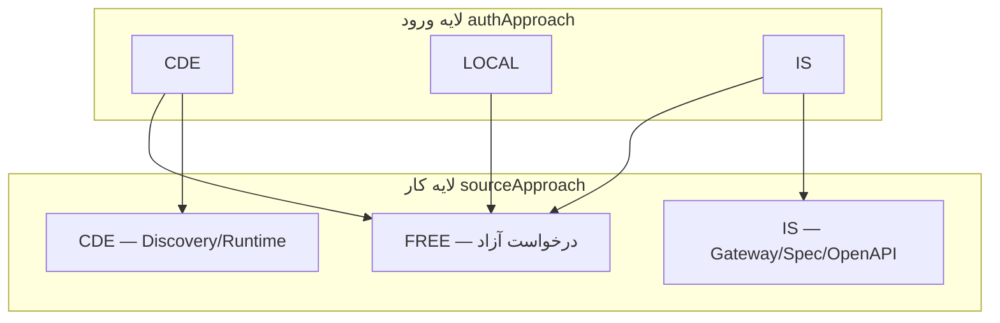
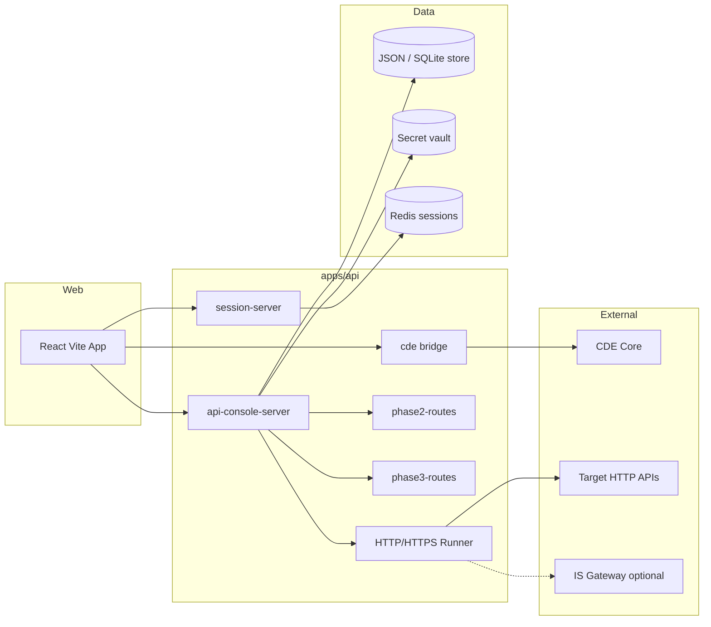
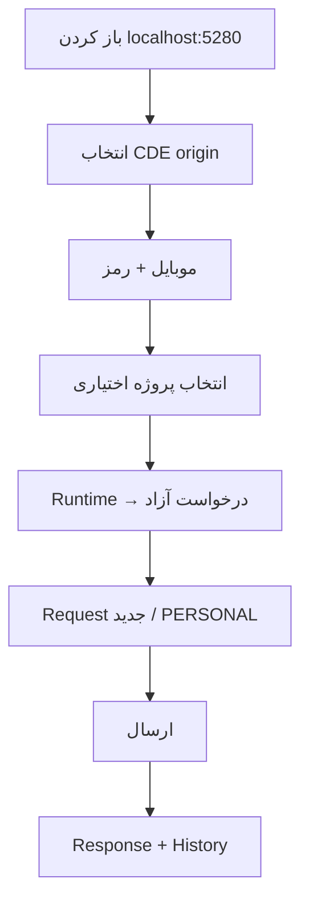
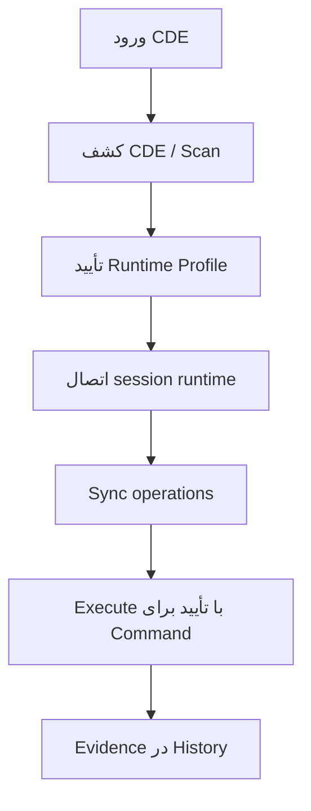
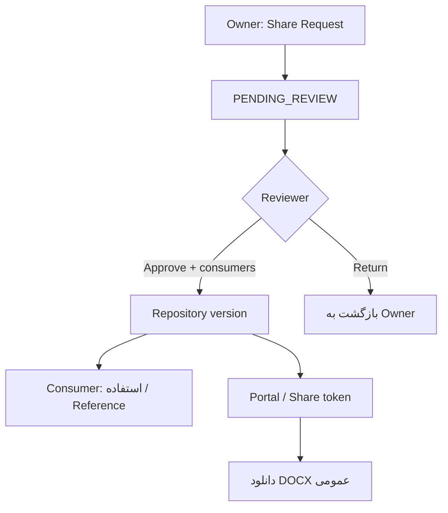
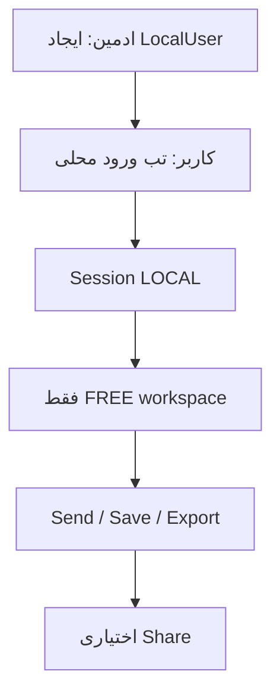
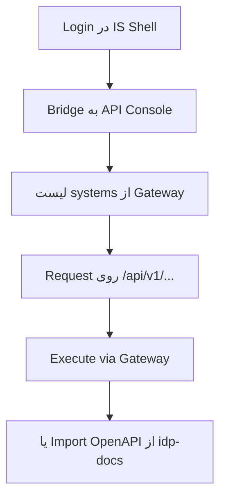
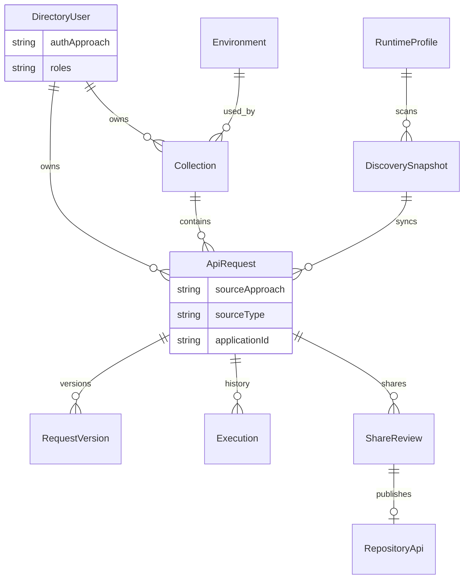

# Product Requirements Document (PRD) — Online API Console

| فیلد | مقدار |
| --- | --- |
| محصول | API Console (standalone) |
| مخزن | `d:\AllApp\API-CONSOLE` |
| نسخه سند | 2.0 — هم‌تراز با پیاده‌سازی فعلی + رویکردهای Local و IS |
| مخاطب سند | PO، BA، Tech Lead، QA، Security |
| اسناد مرتبط | [docs/README.md](./README.md)، [BACKLOG.md](./BACKLOG.md)، [approaches/](./approaches/README.md) |

---

## 1. خلاصه اجرایی

API Console یک سامانهٔ **اجرای کنترل‌شدهٔ HTTP** و **مستندسازی/اشتراک API** است که:

- تجربهٔ نزدیک به Postman را برای **درخواست آزاد** فراهم می‌کند؛
- برای تیم‌های CDE، **کشف و اجرای Runtime** (`ds/` / `fr/`) دارد؛
- باید سه **Approach ورود/کار** را پشتیبانی کند: **CDE** (الان)، **Local Directory** (یوزر/پسورد مدیر)، **Integrated Systems** (پل با `D:\AllApp\IS\integrated-systems`).

**ارزش:** یک نقطهٔ واحد برای ساخت، تست، اشتراک، بازبینی و انتشار مستندات API با کنترل SSRF، Vault، RBAC و Audit سازمانی.

---

## 2. مسئله و اهداف

### 2.1 مسئله

| درد | توضیح |
| --- | --- |
| پراکندگی ابزار | تیم‌ها بین Postman، Swagger، CDE و پورتال‌ها جابه‌جا می‌شوند |
| ورود انحصاری CDE | کاربران غیر-CDE نمی‌توانند حتی Request آزاد بزنند |
| شکاف IS | پلتفرم Integrated Systems مدل Gateway/SSO/Spec جدا دارد و در Console شناسایی نشده |
| ریسک امنیتی | اجرای آزاد URL بدون policy = SSRF / نشت secret |

### 2.2 اهداف محصول

1. ورود چندروشی با یک Workspace مشترک.
2. درخواست آزاد Postman-grade + Discovery CDE + (آینده) کاتالوگ IS.
3. چرخهٔ Share → Review → Repository → Portal + DOCX رسمی.
4. Policy مقصد، Vault، Dual-approval، Audit، نقش‌های سازمانی.
5. DX توسعه محلی: `npm run backend` / `dev` / `dev:kill-ports`.

### 2.3 غیرهدف (فعلاً)

- جایگزینی کامل Gateway یا SSO خودِ IS
- میزبانی production traffic به‌جای سرویس‌های واقعی
- ویرایشگر Spec Runtime کامل داخل Console

---

## 3. Personas

| Persona | نیاز اصلی |
| --- | --- |
| **سیستم ادمین** | کاربران/نقش‌ها، Org policy، Runtime origins، حساب محلی |
| **توسعه‌دهنده CDE** | Discovery، Runtime login، Request آزاد، Share |
| **کاربر غیر-CDE** | ورود یوزر/پسورد، فقط Postman-like |
| **توسعه‌دهنده IS** | ورود با نشست Gateway، سیستم‌ها به‌صورت service-key |
| **QA Lead / Specialist** | Collection runner، Review، Environment |
| **Tech Lead** | Approve share، Production execute، Compliance |
| **BA / PO** | مستند، Portal، مشاهده Repository |
| **Security Reviewer** | Audit، JIT، محدودیت TLS/مقصد |

---

## 4. رویکردهای محصول (Auth × Work Mode)

جزئیات: [approaches/README.md](./approaches/README.md)



| ترکیب مجاز | توضیح |
| --- | --- |
| CDE + FREE | پیاده‌سازی‌شده (`PERSONAL` یا پروژه) |
| CDE + CDE | پیاده‌سازی‌شده (Discovery) |
| LOCAL + FREE | هدف E34 |
| IS + FREE / IS | هدف E35 |
| LOCAL + CDE Discovery | غیرمجاز |

---

## 5. دامنه قابلیت‌ها (وضعیت)

### 5.1 پیاده‌سازی‌شده

- Session cookie + CSRF؛ اعتماد سمت سرور (نه هدر مرورگر)
- ورود CDE multi-origin؛ همگام‌سازی directory
- RBAC هشت نقش + مدیریت کاربران توسط SYSTEM_ADMIN
- Collections / Requests / Versions / Soft-delete
- درخواست آزاد + Import cURL/Postman + Export
- `PERSONAL` بدون الزام سیستم CDE
- Runtime Workspace: آزاد ↔ کشف CDE
- Environments، Vault، Scripts، Assertions
- Execute با DNS public fallback و مسدودسازی SSRF/metadata
- Share Review، Repository، References، Usage reports
- Portal توکن‌دار + دانلود DOCX رسمی
- Phase2: activity، co-owners، collection runner، runners
- Phase3: mocks، contract، JIT، branding، ITSM hooks، OpenAPI export
- `npm run dev:kill-ports`

### 5.2 طراحی‌شده / Backlog

- **E34** Local Directory login
- **E35** IS Gateway bridge + systems + import

---

## 6. معماری منطقی



### 6.1 مسیرهای میزبان

| Surface | Base |
| --- | --- |
| Session | `/api/session*` |
| CDE | `/api/cde*` |
| Console | `/api/api-console*` |
| OpenAPI host | `/api/openapi.json`, `/api/docs` |
| Health | `/api/health` |

### 6.2 مسیرهای UI

| Path | صفحه | دسترسی |
| --- | --- | --- |
| `/`, `/api-console` | Console اصلی | نشست معتبر |
| `/portal` | Portal احرازشده | نشست |
| `/portal/shared/:token` | Portal عمومی | توکن |
| Login gate | CDE (الان) / Local+IS (آینده) | عمومی |

---

## 7. User Stories اولویت‌دار

قالب: *به‌عنوان … می‌خواهم … تا …*

### 7.1 هویت و ورود

| ID | Priority | Status | Story |
| --- | --- | --- | --- |
| US-AUTH-01 | P0 | DONE | به‌عنوان کاربر CDE می‌خواهم با موبایل/رمز وارد شوم تا پروژه‌هایم را ببینم. |
| US-AUTH-02 | P0 | DONE | به‌عنوان ادمین می‌خواهم نقش directory بدهم بدون اینکه auth از مرورگر جعل شود. |
| US-AUTH-03 | P0 | TODO | به‌عنوان مدیر می‌خواهم کاربر محلی بسازم تا غیر-CDE وارد شوند. |
| US-AUTH-04 | P0 | TODO | به‌عنوان کاربر محلی می‌خواهم با یوزر/پسورد وارد Console شوم. |
| US-AUTH-05 | P1 | TODO | به‌عنوان کاربر IS می‌خواهم با نشست Gateway وارد شوم. |

### 7.2 درخواست آزاد (Postman-like)

| ID | Priority | Status | Story |
| --- | --- | --- | --- |
| US-FREE-01 | P0 | DONE | Request خالی با Method/URL/Headers/Body بسازم و Send کنم. |
| US-FREE-02 | P0 | DONE | Collection شخصی (`PERSONAL`) بدون انتخاب سیستم اجباری داشته باشم. |
| US-FREE-03 | P1 | DONE | cURL/Postman وارد/خارج کنم. |
| US-FREE-04 | P0 | DONE | اگر DNS سازمانی IP خصوصی برگرداند، به IPv4 عمومی fallback شود. |

### 7.3 CDE Discovery / Runtime

| ID | Priority | Status | Story |
| --- | --- | --- | --- |
| US-RT-01 | P0 | DONE | Scan بسته CDE و دیدن عملیات. |
| US-RT-02 | P0 | DONE | Runtime Profile امن + اتصال با رمز runtime. |
| US-RT-03 | P0 | DONE | Sync به Collection و Execute ds/fr. |

### 7.4 حکمرانی و انتشار

| ID | Priority | Status | Story |
| --- | --- | --- | --- |
| US-GOV-01 | P0 | DONE | Share → Review → Repository. |
| US-GOV-02 | P1 | DONE | Portal عمومی با دانلود سند رسمی. |
| US-GOV-03 | P0 | DONE | Allowlist/Blocklist مقصد در Org Policy. |

### 7.5 IS

| ID | Priority | Status | Story |
| --- | --- | --- | --- |
| US-IS-01..05 | P1 | TODO | رجوع به [03-integrated-systems.md](./approaches/03-integrated-systems.md) |

---

## 8. User Flows

### 8.1 Flow A — ورود CDE و درخواست آزاد



### 8.2 Flow B — کشف و اجرای Runtime



### 8.3 Flow C — اشتراک تا Portal



### 8.4 Flow D — کاربر محلی (هدف)



### 8.5 Flow E — کاربر IS (هدف)



---

## 9. مدل داده مفهومی



شناسه‌های مهم:

- `applicationId = PERSONAL` → بدون سیستم
- `sourceType = CDE_DISCOVERY` → از Sync
- `authApproach` → CDE | LOCAL | IS (LOCAL/IS در E34/E35)

---

## 10. RBAC (خلاصه)

| قابلیت | نقش‌های اصلی |
| --- | --- |
| مشاهده | همه نقش‌های کنسول |
| ایجاد/ویرایش Request | Admin, Dev, QA, BA, Tech Lead |
| Execute | + Security؛ نه فقط BA/PO |
| Execute Production | Admin, Tech Lead, QA Lead |
| Review Share | Admin, Tech Lead, QA Lead |
| Manage Users / Org Policy | SYSTEM_ADMIN |
| Bootstrap Admin | `API_CONSOLE_ADMIN_LOGINS` |

جزئیات: `GET /api/api-console/policy` و بخش RBAC در [ONLINE_API_CONSOLE.md](./ONLINE_API_CONSOLE.md).

---

## 11. امنیت و مقصدها

- مسدودسازی localhost، metadata، link-local، برخی multicast
- Allowlist خالی = باز برای مقصد عمومی (به‌علاوه hard-block)
- Blocklist بک‌آفیس و Org Policy
- DNS: ترجیح IPv4 عمومی؛ تشخیص IPv6 سازمانی با IPv4 جاسازی‌شده (مثل `…:10:10:34:35`)
- `API_CONSOLE_DNS_SERVERS` (پیش‌فرض `8.8.8.8,1.1.1.1`)
- Vault برای secret؛ masking در audit/UI
- CSRF روی session cookie

---

## 12. نیازهای غیرعملکردی

| حوزه | نیاز |
| --- | --- |
| دسترس‌پذیری محلی | Web 5280، API 5281 (+ fallback)؛ kill-ports فقط پروسه‌های همین ریپو |
| مشاهده‌پذیری | Audit، activity feed، correlation id اجرا |
| پایداری داده | FILE یا SQLITE؛ backup/restore مستند |
| i18n UI | فارسی برای سطح کاربر |
| مستند API میزبان | Swagger `/api/docs` |

---

## 13. معیارهای پذیرش محصول (سطح PRD)

1. سه Approach در UI ورود قابل انتخاب باشند (CDE الان؛ Local و IS طبق flag).
2. کاربر LOCAL بتواند بدون CDE Request آزاد Send کند.
3. کاربر CDE بتواند Discovery و FREE را جدا استفاده کند.
4. کاربر IS بتواند حداقل یک service-key را ببیند و یک GET از طریق Gateway اجرا کند (پس از E35).
5. Share/Portal/Policy برای همه Approachهای مجاز یکسان بماند مگر استثنای صریح.
6. هیچ secret در Export Postman/cURL به‌صورت خام ذخیرهٔ سمت کلاینت نرود.
7. ماتریس تست ریشه برای session، admin، runtime، phase2/3 سبز باشد.

---

## 14. نقشه انتشار پیشنهادی

| فاز | محتوا |
| --- | --- |
| **اکنون** | تثبیت FREE+CDE، docs، DNS، kill-ports |
| **PI بعدی** | E34 Local Directory end-to-end |
| **PI بعد** | E35 IS bridge MVP (session + systems + execute) |
| **ادامه** | Import OpenAPI IS، همراستایی access rules |

---

## 15. ریسک‌ها

| ریسک | کاهش |
| --- | --- |
| دو منبع حقیقت نقش (CDE vs Local vs IS) | یک Directory با `identitySource` |
| دور زدن Gateway در Approach IS | اجرای پیش‌فرض فقط از طریق Gateway URL |
| سردرگمی UX سه تب ورود | یک صفحه ورود با کارت‌های Approach |
| وابستگی DNS سازمانی | public resolver + پیام خطای قابل اقدام |

---

## 16. ضمیمه — دستورات

```bash
npm install
npm run dev:kill-ports
npm run backend
npm run dev
npm run test:all -w @api-console/api
npm run backend:self-check
```

---

## 17. تاریخچه سند

| نسخه | تاریخ | تغییر |
| --- | --- | --- |
| 1.x | پیشین | سند پیاده‌سازی CDE-only در ONLINE_API_CONSOLE |
| 2.0 | 2026-09-03 | PRD کامل؛ Approaches CDE/Local/IS؛ هم‌ترازسازی با PERSONAL، Portal DOCX، DNS، kill-ports |
