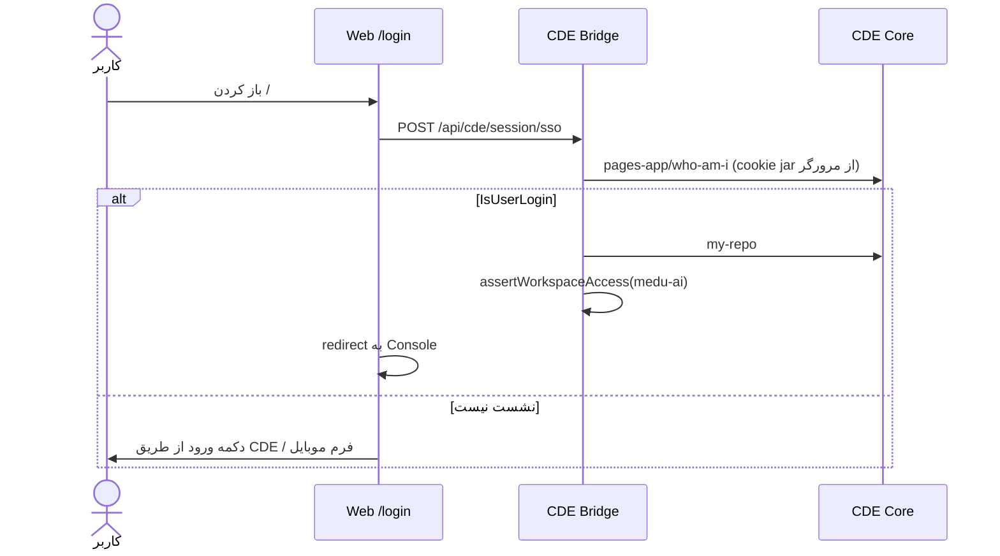
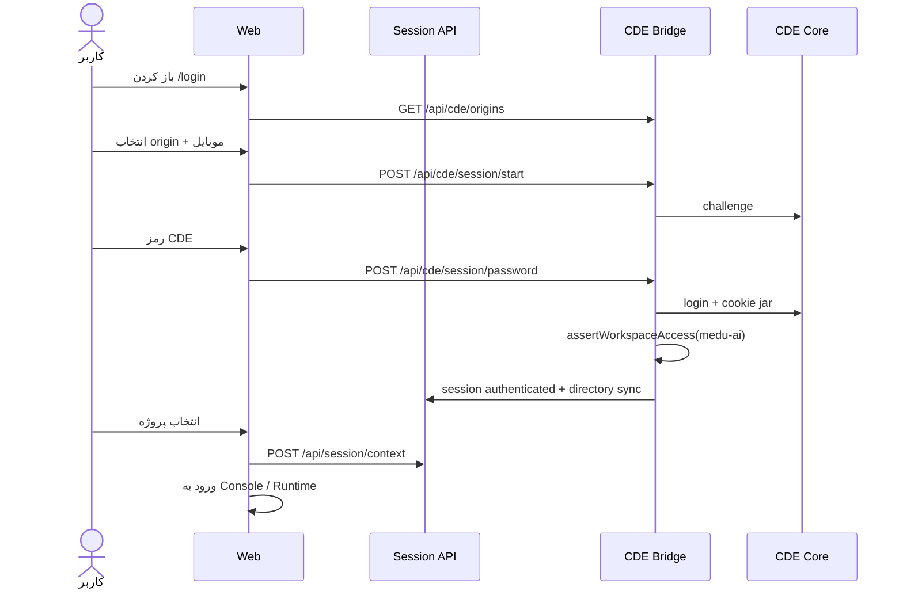
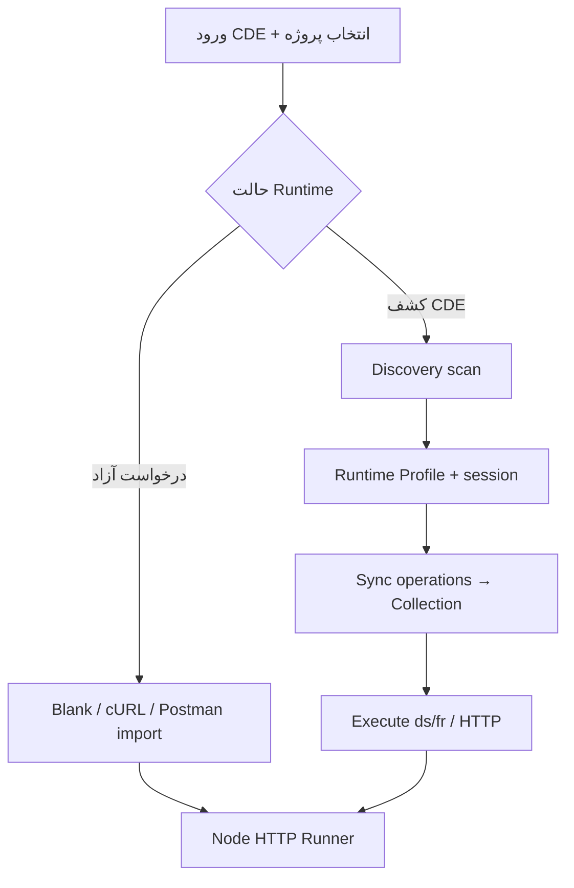

# Approach: CDE (Control Plane)

**وضعیت:** پیاده‌سازی‌شده و مسیر پیش‌فرض فعلی.

## مخاطب

توسعه‌دهندگان و QA که روی پروژه‌های CDE (`cde.edus.ir` یا multi-origin) کار می‌کنند و باید عملیات `ds/` / `fr/` و سرویس واقعی پروژه را کشف و اجرا کنند.

## ورود

### مسیر اصلی — SSO کوکی (same-site)

وقتی کنسول زیر همان دامنه‌ی مادر CDE میزبانی شود (مثلاً `api-console.edus.ir`)، کوکی‌های مرورگر به بک‌اند می‌رسند و بدون فرم رمز، `who-am-i` زده می‌شود.

### مسیر جایگزین — موبایل / رمز

### مسیرها

| مرحله | مسیر |
| --- | --- |
| SSO config | `GET /api/cde/sso/config` |
| SSO probe | `POST /api/cde/session/sso` |
| Origins | `GET /api/cde/origins` |
| Start | `POST /api/cde/session/start` |
| Password | `POST /api/cde/session/password` |
| Projects | `GET /api/cde/projects` |
| Context | `POST /api/session/context` |
| Workspace gate | `API_CONSOLE_REQUIRED_WORKSPACES` (پیش‌فرض `medu-ai`) |
| Bootstrap admins | `API_CONSOLE_ADMIN_LOGINS` / `API_CONSOLE_QA_LEAD_LOGINS` |

### گیت ورک‌اسپیس

فقط دارندگان project keyهای `API_CONSOLE_REQUIRED_WORKSPACES` (پیش‌فرض `medu-ai`) **وارد** کنسول می‌شوند. پیش‌فرض حالت `GATE_ONLY` است: عضویت فقط شرط ورود است و بعد از ورود همهٔ پروژه‌ها/سامانه‌های CDE قابل انتخاب‌اند. حالت `RESTRICT` فقط وقتی صریحاً ست شود لیست را به ورک‌اسپیس‌های allowlist محدود می‌کند. خطای استاندارد: `403 WORKSPACE_ACCESS_DENIED`.

ورود با کوکی (SSO) فقط وقتی کنسول روی دامنهٔ مشترک با CDE باشد؛ روی localhost از شماره همراه و رمز استفاده کنید. UI می‌تواند پاپ‌آپ لاگین CDE را باز کند و سپس probe بزند.

## دو حالت کار بعد از ورود

1. **درخواست آزاد (`sourceApproach=FREE`)** — Postman-like؛ Collection روی پروژه CDE یا `PERSONAL`.
2. **کشف CDE (`sourceApproach=CDE` / `sourceType=CDE_DISCOVERY`)** — Scan بسته، Runtime Profile، Sync به Collection، Execute از طریق Runtime proxy.

## User Stories کلیدی

| ID | Story |
| --- | --- |
| US-CDE-01 | به‌عنوان توسعه‌دهنده CDE می‌خواهم با موبایل/رمز وارد شوم تا پروژه‌هایم را ببینم. |
| US-CDE-02 | به‌عنوان Tech Lead می‌خواهم چند Runtime Origin مجاز Development را برای یک، چند یا همهٔ سامانه‌ها provision کنم تا توسعه‌دهنده از طریق `/devlogin` به میزبان درست متصل شود. |
| US-CDE-03 | به‌عنوان QA می‌خواهم عملیات کشف‌شده را Sync و Regression روی Collection اجرا کنم. |
| US-CDE-04 | به‌عنوان توسعه‌دهنده می‌خواهم بدون وابستگی به CDE Discovery هم درخواست HTTP آزاد بزنم (`PERSONAL` یا پروژه). |

## فایل‌های مرجع

- `apps/web/src/pages/LandingPage.tsx` — SSO landing + probe
- `apps/web/src/pages/WorkspaceDeniedPage.tsx` — خطای ورک‌اسپیس
- `apps/web/src/pages/CdeLoginPage.tsx` — فرم موبایل/رمز (fallback)
- `apps/api/src/modules/cde/` — bridge + `cde-sso.cjs`
- `apps/api/src/modules/access/workspace-access.cjs` — گیت `medu-ai`
- `apps/web/src/components/api-console/RuntimeWorkspace.tsx`
- `docs/OPENAPI.md` — ds/fr mapping
- `docs/persistence/POSTGRES.md` — اسکیماهای Postgres
