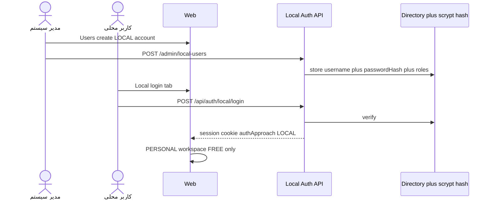

# Approach: Local Directory (غیر-CDE)

**وضعیت:** پیاده‌سازی‌شده (E34) — ورود محلی + CRUD ادمین روی `directoryUsers` با `source: LOCAL`.

## مسئله

بسیاری از کاربران (پیمانکار، تستر خارجی، BA، تیم‌هایی خارج از CDE) نیاز به **همان تجربه Postman** دارند اما حساب CDE ندارند. بدون Local Directory فقط ورود CDE در دسترس بود.

## هدف

مدیر سیستم حساب محلی (یوزرنیم + پسورد) تعریف کند؛ کاربر وارد شود و فقط از قابلیت‌های **درخواست آزاد / Collection / Environment / Vault محدود / Share طبق RBAC** استفاده کند — بدون Discovery و Runtime CDE.

## ورود



### قرارداد API (پیاده‌سازی‌شده)

| Method | Path | نقش |
| --- | --- | --- |
| POST | `/api/auth/local/login` | عمومی (rate-limited) |
| POST | `/api/auth/local/logout` | نشست + CSRF |
| GET/POST | `/api/api-console/admin/local-users` | `SYSTEM_ADMIN` |
| PATCH | `/api/api-console/admin/local-users/:id` | `SYSTEM_ADMIN` (نام / isActive) |
| POST | `/api/api-console/admin/local-users/:id/reset-password` | `SYSTEM_ADMIN` |

کاربران محلی روی همان `directoryUsers` با فیلدهای `username`، `passwordHash`، `passwordUpdatedAt`، `lastLoginAt` ذخیره می‌شوند. هش: `scrypt$N$r$p$salt$hash`.

### Session

```text
authApproach: 'LOCAL'
applicationId / projects: ['PERSONAL']
// بدون cdeSession / بدون گیت medu-ai
```

## محدودیت‌های Approach

| مجاز | غیرمجاز |
| --- | --- |
| CRUD درخواست آزاد | Discovery scan CDE |
| Collection PERSONAL | Runtime Profile CDE |
| Import/Export cURL / Postman | اتصال به CDE package |
| Environments طبق policy | Execute Production بدون نقش مجاز |
| Share → Review طبق RBAC | مدیریت Origins CDE |

## معیار پذیرش Epic E34

- [x] تب ورود محلی در کنار CDE
- [x] CRUD کاربر محلی فقط برای SYSTEM_ADMIN
- [x] Session با `authApproach=LOCAL` بدون CDE cookie jar
- [x] دسترسی به درخواست آزاد + محدودیت Discovery (UI + API 403)
- [x] تست `local-auth.test.cjs`
- [x] به‌روزرسانی این سند
