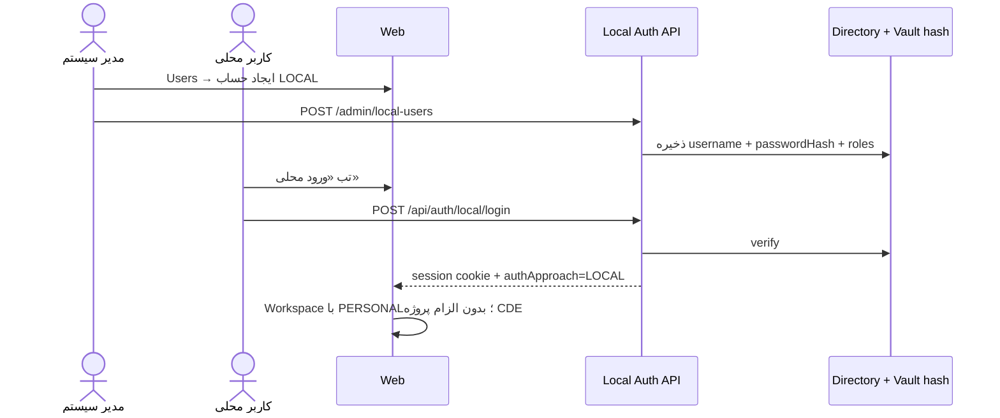
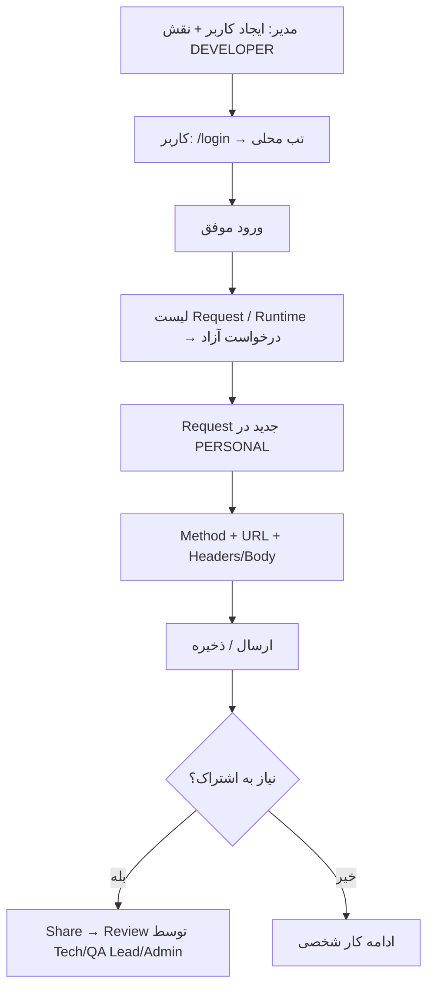

# Approach: Local Directory (غیر-CDE)

**وضعیت:** طراحی محصولی کامل در PRD؛ پیاده‌سازی در Backlog **E34** (`TODO`).

## مسئله

بسیاری از کاربران (پیمانکار، تستر خارجی، BA، تیم‌هایی خارج از CDE) نیاز به **همان تجربه Postman** دارند اما حساب CDE ندارند. امروز Gate اپ فقط `CdeLoginPage` است؛ بدون CDE هیچ دسترسی به Console نیست.

## هدف

مدیر سیستم حساب محلی (یوزرنیم + پسورد) تعریف کند؛ کاربر وارد شود و فقط از قابلیت‌های **درخواست آزاد / Collection / Environment / Vault محدود / Share طبق RBAC** استفاده کند — بدون Discovery و Runtime CDE.

## ورود هدف



### قرارداد پیشنهادی API

| Method | Path | نقش |
| --- | --- | --- |
| POST | `/api/auth/local/login` | عمومی (rate-limited) |
| POST | `/api/auth/local/logout` | نشست |
| GET/POST/PATCH/DELETE | `/api/api-console/admin/local-users` | `SYSTEM_ADMIN` |
| POST | `/api/api-console/admin/local-users/:id/reset-password` | `SYSTEM_ADMIN` |

### مدل داده پیشنهادی

```text
LocalUser {
  id, username, displayName, passwordHash, roles[],
  status: ACTIVE|DISABLED, createdBy, createdAt, lastLoginAt
}
Session {
  ...existing,
  authApproach: 'LOCAL',
  identitySource: 'LOCAL_DIRECTORY',
  // بدون cdeSession / بدون الزام projectKey
  applicationScope: ['PERSONAL'] | managed list
}
```

## محدودیت‌های Approach (Scope)

| مجاز | غیرمجاز (مگر ارتقا نقش/پل) |
| --- | --- |
| CRUD درخواست آزاد | Discovery scan CDE |
| Collection `PERSONAL` یا Shared محلی | Runtime Profile CDE |
| Import/Export cURL / Postman | اتصال به CDE package |
| Environments غیر Production (طبق policy) | Execute Production بدون نقش مجاز |
| Share → Review (اگر نقش review دارد) | مدیریت Origins CDE |

## User Stories

| ID | Story | AC خلاصه |
| --- | --- | --- |
| US-LOC-01 | به‌عنوان مدیر سیستم می‌خواهم کاربر محلی بسازم تا بدون CDE وارد شوند. | CRUD + reset password + DISABLE |
| US-LOC-02 | به‌عنوان کاربر محلی می‌خواهم با یوزر/پسورد وارد شوم و Request آزاد بفرستم. | Session + PERSONAL + Send |
| US-LOC-03 | به‌عنوان مدیر می‌خواهم نقش‌های محلی (DEVELOPER/QA/…) بدهم. | همان RBAC کنسول |
| US-LOC-04 | به‌عنوان امنیت می‌خواهم پسورد هش شود و brute-force محدود شود. | hash + rate limit + audit |
| US-LOC-05 | به‌عنوان کاربر محلی نمی‌خواهم UI کشف CDE را ببینم مگر دسترسی جدا. | Gate ویژگی بر اساس `authApproach` |

## User Flow — روز اول کاربر محلی



## وابستگی به پیاده‌سازی فعلی

- Directory کاربران هم‌اکنون بعد از CDE sync می‌شود؛ E34 باید منبع `LOCAL` را اضافه کند.
- `PERSONAL` و `sourceApproach=FREE` هم‌اکنون بعد از ورود CDE کار می‌کنند — هستهٔ Runner آماده است.
- Gate در `apps/web/src/App.tsx` باید `localAuthenticated || cdeConnected` شود.

## معیار پذیرش Epic E34

- [ ] تب ورود محلی در کنار CDE
- [ ] CRUD کاربر محلی فقط برای SYSTEM_ADMIN
- [ ] Session با `authApproach=LOCAL` بدون CDE cookie jar
- [ ] دسترسی کامل به درخواست آزاد + محدودیت Discovery
- [ ] تست session-trust و admin برای local login
- [ ] به‌روزرسانی OpenAPI و این سند پس از Done
