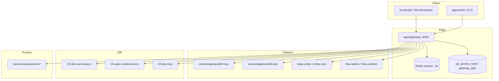
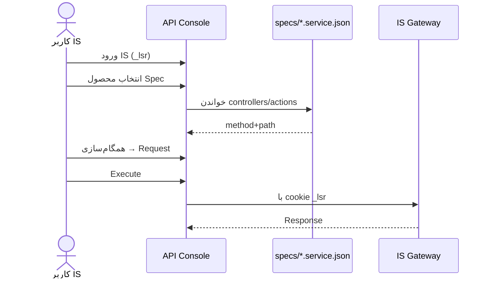

# Approach: Integrated Systems (IS)

**وضعیت:** پیاده‌سازی‌شده (لاگین + session + کشف Spec-first از `*.service.json` + sync به Request + اجرای Gateway با Cookie).  
**منبع کد مرجع:** `D:\AllApp\IS\integrated-systems`  
**کد Console:** `apps/api/src/modules/is/is-auth-server.cjs` ، تب «ورود IS» در `CdeLoginPage.tsx`

## IS چیست؟ (شناسایی)

Integrated Systems یک **مونورپوی مدرسه / آموزش** است: میکروسرویس + میکروفرانت پشت **API Gateway**، با **SSO/IAM**، **Spec-first** و **IDP** — نه یک کلاینت Postman مستقل.



### نگاشت پوشه‌ها

| مسیر IS | نقش برای API Console |
| --- | --- |
| `apps/gateway` | نقطهٔ اجرای واقعی API؛ proxy + access control |
| `services/general/00-sso` | ورود پسورد (dev) / External SSO (prod) |
| `services/idp/03-docs-and-specs` | کاتالوگ OpenAPI |
| `services/idp/05-spec-runtime-demo` | اجرای action / HTTP مقید به Spec |
| `specs/medu-apps`, `specs/edus-apps` | «Collection» سطح محصول |
| `databases/*api_access_rules*` | Policy نقش@مسیرسازمان |
| `portals/*` | محیط / portal host |

### احراز هویت IS (وضعیت واقعی کد)

1. Shell → MF SSO (`frontends/general/00-mf-sso`)
2. `POST /api/v1/sso/login` (اگر `SSO_PASSWORD_LOGIN_ENABLED`) یا External SSO
3. Cookie نشست **`_lsr`** در Redis (Gateway و SSO یک `SESSION_SECRET` دارند)
4. Gateway: session → `apiRegistry` → `accessControl` (نقش به شکل `role@organPath`) → proxy به سرویس

پیشوند یکنواخت سرویس‌ها: `/api/v1/<service-key>/...`

## نگاشت مفهومی API Console ↔ IS

| مفهوم Console | معادل IS |
| --- | --- |
| Environment | Portal host + `SPECS_ROOT` + `SPEC_EXT_*` |
| Collection | Spec folder / بستهٔ محصول در `specs/` یا سند OpenAPI در Docs & Specs |
| System / Application | `service-key` در Gateway (`config/services.ts`) |
| Free HTTP | اجرای مستقیم از طریق Gateway (با session) یا Spec Runtime `method+path` |
| Org policy | `api_access_rules` + `gateway_apis.is_enabled` |
| Auth profile | نشست `_lsr` / partner Bearer / active-role |
| Batch run | `POST /api/v1/batch` |

## کشف و بارگذاری API (spec-first)

منبع اصلی APIهای محصول، **دیسک Spec** است نه فقط رجیستری Gateway:

```
SPECS_ROOT (مثلاً specs/medu-apps)
  index.json          → categories + spec-folders
  <category>/<slug>/
    index.spec.json   → entityCore.service → *.service.json
    runtime/entity-core-specs/*.service.json
      services[].base_url
      controllers[].path + actions[].method/path
```

| مرحله | منبع | خروجی |
| --- | --- | --- |
| Workspaces / محصولات | `API_CONSOLE_IS_SPECS_ROOT` → `index.json` + `*.service.json` | `is:<service-key از base_url>` |
| عملیات | Flatten controller/action → Gateway path | method + `/api/v1/...` |
| غنی‌سازی اختیاری | `gateway-apis` + OpenAPI idp-docs (اگر `_lsr` باشد) | شمارنده‌های Gateway/OpenAPI |
| همگام‌سازی | `POST /api/api-console/is/systems/:key/sync` | Collection `IS · …` + Requestهای `IS_DISCOVERY` |
| اجرای بدون rule (dev) | Gateway: `GATEWAY_ALLOW_MISSING_ACCESS_RULES` (پیش‌فرض non-prod = allow) | مسیر بدون `api_access_rules` برای کاربر لاگین‌شده رد نمی‌شود |
| بازیابی Console | `API_CONSOLE_IS_AUTO_ENSURE_ACCESS_RULES=true` | روی 403، یک‌بار `POST /api/v1/iam/rules` با `is_public` سپس retry |

UI: تب **کشف IS** — فیلتر Workspace / دسته / محصول Spec، سپس همگام‌سازی به Collection.

کاربرانی که روی IS کار می‌کنند بتوانند:

1. با **پل نشست IS** (cookie `_lsr` یا login) وارد Console شوند (`authApproach=IS`).
2. **محصولات** را از درخت Spec ببینند (نه فقط service-keyهای استاتیک Gateway).
3. Request بسازند که URL آن‌ها `GATEWAY_BASE` + path از `base_url` + controller + action باشد.
4. اختیاری: غنی‌سازی از OpenAPI / gateway-apis.
5. همچنان درخواست کاملاً آزاد را با destination policy بزنند.



### قرارداد API

| Method | Path | توضیح |
| --- | --- | --- |
| GET | `/api/auth/is/config` | `gatewayBaseUrl`, حالت فعال |
| POST | `/api/auth/is/login` | ورود cellphone/password → session |
| POST | `/api/auth/is/session/bridge` | تبادل `_lsr` → session Console |
| GET | `/api/api-console/is/workspaces` | لیست ریشه‌های Spec |
| GET | `/api/api-console/is/products?workspace=&category=` | محصولات از index.json |
| GET | `/api/api-console/is/systems` | محصولات (+ غنی‌سازی catalog) |
| GET | `/api/api-console/is/systems/:key/apis` | actions از `*.service.json` |
| POST | `/api/api-console/is/systems/:key/sync` | Collection + Requestهای `IS_DISCOVERY` |
| POST | `/api/api-console/requests/:id/execute` | اجرا از طریق Gateway با `_lsr` |

Env:

```bash
API_CONSOLE_IS_ENABLED=true
API_CONSOLE_IS_GATEWAY_URL=http://127.0.0.1:4000
API_CONSOLE_IS_SPECS_ROOT=D:/AllApp/IS/integrated-systems/specs/medu-apps,D:/AllApp/IS/integrated-systems/specs/edus-apps
API_CONSOLE_IS_SESSION_COOKIE=_lsr
```

## User Stories

| ID | Story |
| --- | --- |
| US-IS-01 | به‌عنوان توسعه‌دهنده IS می‌خواهم بدون حساب CDE، با نشست Gateway وارد Console شوم. |
| US-IS-02 | به‌عنوان توسعه‌دهنده می‌خواهم سیستم‌ها را به‌صورت service-key ببینم و Request روی `/api/v1/...` بسازم. |
| US-IS-03 | به‌عنوان Tech Lead می‌خواهم OpenAPI سرویس را از Docs & Specs وارد Collection کنم. |
| US-IS-04 | به‌عنوان امنیت می‌خواهم اجرای IS فقط با هویت و قوانین access IS انجام شود (نه دور زدن Gateway). |
| US-IS-05 | به‌عنوان QA می‌خواهم batch Gateway یا Collection Runner را برای رگرسیون IS استفاده کنم. |

## مسیرهای مهم IS برای شناسایی در اجرا

| سطح | مثال |
| --- | --- |
| SSO | `/api/v1/sso/login`, `/me`, `/active-role` |
| Gateway | `POST /api/v1/batch`, proxy `/api/v1/<service>/...` |
| Docs | `/api/v1/idp-docs/.../openapi.json` |
| Spec Runtime | `POST /api/v1/idp-spec-runtime/runtime/:specFolder/actions/execute` |

جزئیات پورت‌های dev و runbook: `D:\AllApp\IS\integrated-systems\docs\run-dev-stack.md`

## معیار پذیرش Epic E35

- [ ] تشخیص و مستندسازی ساختار IS (این سند) — **Done در سطح docs**
- [ ] Feature flag اتصال به Gateway
- [ ] Bridge نشست `_lsr` → session Console
- [ ] لیست systems از Gateway/IDP
- [ ] اجرای Request با `sourceApproach=IS` از طریق Gateway
- [ ] Import OpenAPI از idp-docs (حداقلی)
- [ ] تست integration با Gateway mock یا stack محلی
