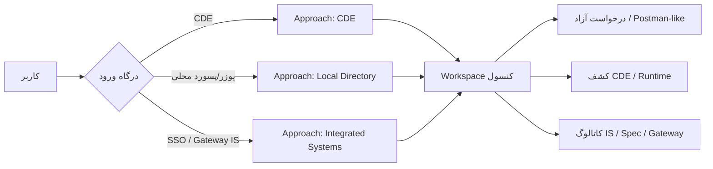

# رویکردهای کار با API Console

سامانه سه **Approach** برای ورود و کار دارد. هر رویکرد هویت، دامنهٔ سیستم‌ها، و نوع درخواست‌ها را مشخص می‌کند؛ هستهٔ Runner، Collection، Environment، Vault، Share/Portal و Policy مشترک است.

| Approach | سند | ورود | حوزهٔ اصلی |
| --- | --- | --- | --- |
| **CDE** | [01-cde.md](./01-cde.md) | موبایل + رمز CDE (+ انتخاب origin) | کشف پروژه، Runtime Profile، ds/fr |
| **Local Directory** | [02-local-directory.md](./02-local-directory.md) | یوزرنیم/پسورد تعریف‌شده توسط مدیر سیستم | درخواست آزاد، Collection شخصی، بدون وابستگی CDE |
| **Integrated Systems** | [03-integrated-systems.md](./03-integrated-systems.md) | نشست SSO/`_lsr` یا پل Gateway | سرویس‌کلیدهای Gateway، Spec workspace، OpenAPI IS |

## ماتریس قابلیت

| قابلیت | CDE | Local | IS |
| --- | --- | --- | --- |
| درخواست آزاد (Generic HTTP) | ✅ | ✅ (هدف اصلی) | ✅ (روی مسیرهای مجاز Gateway / external) |
| کشف CDE + Runtime execute | ✅ | ❌ | ❌ |
| PERSONAL / بدون سیستم اجباری | ✅ | ✅ | اختیاری |
| سیستم به‌عنوان پروژه CDE | ✅ | ❌ | — |
| سیستم به‌عنوان service-key Gateway | — | — | ✅ |
| Collection از Spec / OpenAPI IS | — | — | ✅ (هدف) |
| Share / Portal / Review | ✅ | ✅ (با RBAC محلی) | ✅ (با نقش IS یا نقش کنسول) |
| Org destination policy / SSRF | ✅ | ✅ | ✅ (+ تطبیق با `api_access_rules` در آینده) |

## شناسه در داده

پیشنهاد قرارداد (پیاده‌سازی تدریجی):

| فیلد | معنی |
| --- | --- |
| `authApproach` | `CDE` \| `LOCAL` \| `IS` — نحوهٔ ورود نشست |
| `sourceApproach` | `FREE` \| `CDE` \| `IS` — منشأ ساخت/اجرای Request |
| `applicationId` | `PERSONAL` یا شناسهٔ سیستم CDE یا `is:<serviceKey>` |

فیلتر فعلی API: `GET /api/api-console/requests?sourceApproach=FREE|CDE`.
