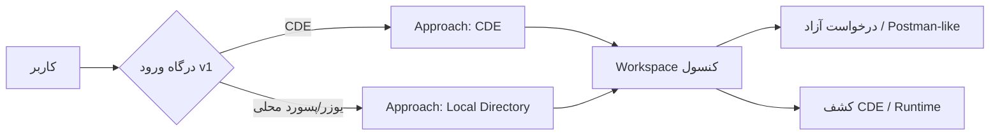

# رویکردهای کار با API Console

سامانه سه **Approach** برای ورود و کار دارد. هستهٔ Runner، Collection، Environment، Vault، Share/Portal و Policy مشترک است.

**نسخهٔ v1 (تحویل فعلی):** فقط **CDE** و **Local Directory** در محصول فعال‌اند. **Integrated Systems عمداً خاموش** است تا پس از go-live زیر بار فعال شود.

| Approach | سند | ورود | وضعیت v1 |
| --- | --- | --- | --- |
| **CDE** | [01-cde.md](./01-cde.md) | موبایل + رمز CDE (+ origin) | **فعال** |
| **Local Directory** | [02-local-directory.md](./02-local-directory.md) | یوزرنیم/پسورد ادمین | **فعال** |
| **Integrated Systems** | [03-integrated-systems.md](./03-integrated-systems.md) | Gateway / `_lsr` | **Deferred** — `API_CONSOLE_IS_ENABLED=false` |

## ماتریس قابلیت (v1)

| قابلیت | CDE | Local | IS (بعداً) |
| --- | --- | --- | --- |
| درخواست آزاد (Generic HTTP) | ✅ | ✅ | ✅ (پس از فعال‌سازی) |
| کشف CDE + Runtime execute | ✅ | ❌ | ❌ |
| PERSONAL / بدون سیستم اجباری | ✅ | ✅ | اختیاری |
| Share / Portal / Review | ✅ | ✅ | ✅ |
| Org destination policy / SSRF | ✅ | ✅ | ✅ |

استقرار: [deploy/PRODUCTION.md](../deploy/PRODUCTION.md).

## شناسه در داده

| فیلد | معنی |
| --- | --- |
| `authApproach` | `CDE` \| `LOCAL` \| `IS` — نحوهٔ ورود نشست |
| `sourceApproach` | `FREE` \| `CDE` \| `IS` — منشأ ساخت/اجرای Request |
| `applicationId` | `PERSONAL` یا شناسهٔ سیستم CDE یا `is:<serviceKey>` |
